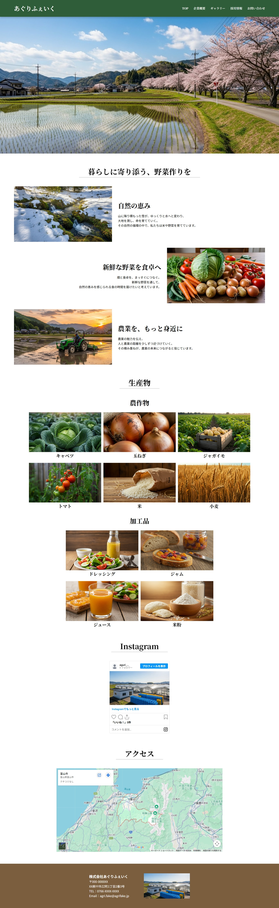
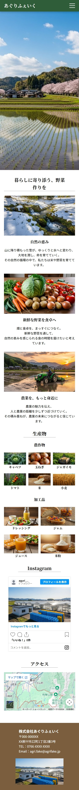
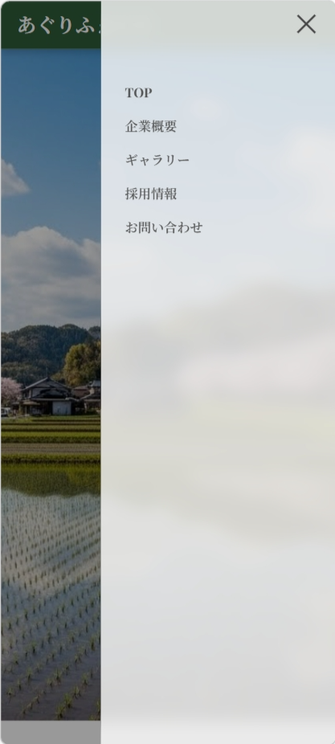

## あぐりふぇいく コーポレートサイト
ポートフォリオ作品として制作したWebアプリケーションです。  
架空の農業企業「あぐりふぇいく」のコーポレートサイトを想定し、問い合わせ機能や採用応募機能、管理画面によるコンテンツ管理機能を実装しています。

## アプリケーション概要
企業サイトとして以下の機能を実装しています。
- お問い合わせフォーム
- 採用応募フォーム
- ギャラリー管理機能（管理画面）
- ギャラリー公開 / 非公開の切り替え

## 今後実装予定
- 採用募集要項管理機能
　管理画面から募集職種・仕事内容・勤務地などを登録できる機能を追加予定

## 使用技術
- フロントエンド
HTML
CSS
JavaScript
- バックエンド
Java
Spring Boot
Thymeleaf
- その他
Gmail SMTP（メール送信）
Google Maps API（地図表示）
Instagram Embed（投稿表示）
SEO対策

## 主な機能
**ユーザー側**
- 会社情報閲覧
- ギャラリー閲覧
- 募集要項閲覧
- 採用応募フォーム
- お問い合わせフォーム

**管理者側**
- ギャラリー投稿
- ギャラリー編集
- ギャラリー公開 / 非公開切り替え
- ギャラリー論理削除
（今後実装予定）
- 募集要項投稿
- 募集要項編集
- 募集要項公開 / 非公開切り替え
- 募集要項論理削除

## セキュリティ対策
- 入力値バリデーション
- CSRF対策（Spring Security）
- 環境変数によるメール認証情報管理
- XSS対策
- メールヘッダインジェクション対策  
  メール送信処理では、ユーザー入力に含まれる改行文字（\r / \n）を除去することで、メールヘッダインジェクション攻撃を防止しています。

## 動作環境 
本アプリケーションは現在開発途中のため、デプロイは行っていません。 ローカル環境で動作確認を行っています。  
**環境設定**  
本プロジェクトでは、メール認証情報などの機密情報を含むため
`application.properties` は GitHub に含めていません。

## 設計書
画面遷移図・ER図・機能設計などの詳細な設計については以下のNotionドキュメントにまとめています。  
※本ポートフォリオは現在も改善を行っているため、設計書は実装に合わせて随時更新しています。
NotionURL:https://www.notion.so/31fa41d8965780e3b2e4f83762af2951?source=copy_link

## 制作目的
- Spring Bootを用いたWebアプリケーション開発の学習
- 企業サイトを想定したフォーム処理・管理機能の実装
- セキュリティを意識したWebアプリケーション開発の実践

## 画面イメージ
### PC トップ画面

### SP トップ画面

### SP サイドバー表示
